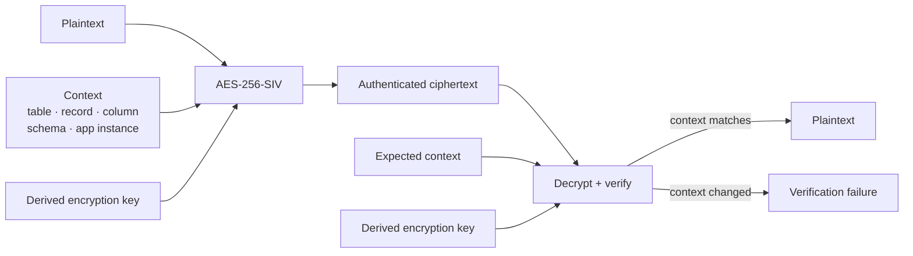
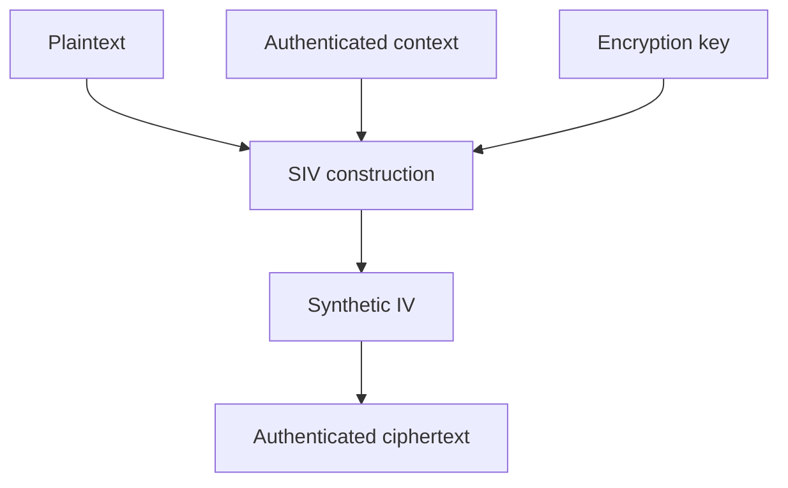
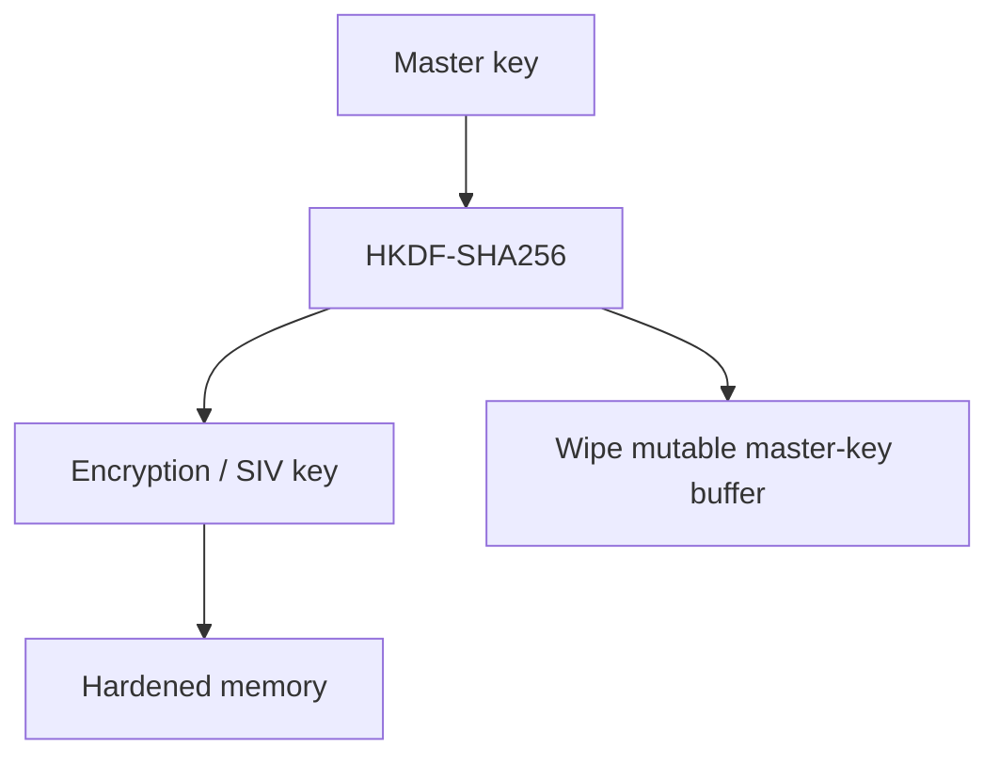
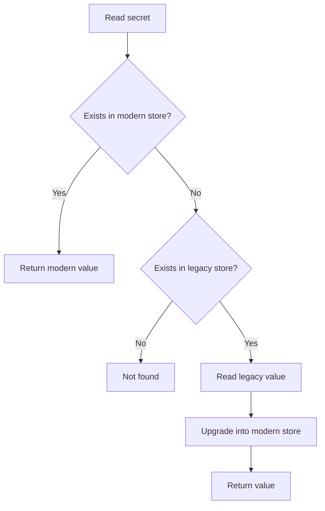

<div align="center">

# 🔐 FloorVault

### Context-aware, misuse-resistant encryption for SQLite

**Secure local data without replacing SQLite or compiling database extensions.**

[](https://pypi.org/project/floorvault/)
[](LICENSE)
[](https://pypi.org/project/floorvault/)

<br>

[**Quickstart**](#-quickstart) ·
[**Why FloorVault?**](#-why-floorvault) ·
[**Security Model**](#-security-model) ·
[**Performance**](#-performance) ·
[**Roadmap**](#-roadmap)

</div>

---

> [!IMPORTANT]
> **FloorVault is an application-layer encryption library, not a replacement database.**
>
> It works with standard Python `sqlite3` and PyCA `cryptography`, giving applications field- and record-level authenticated encryption, contextual tamper resistance, hardened key handling, and migration tooling without requiring SQLCipher or a custom SQLite build.

## ✨ What FloorVault Does

FloorVault is designed for applications that need **secure local storage without giving up normal SQLite**.

It provides:

- 🔗 **Contextual AEAD binding** — ciphertext is cryptographically tied to the table, record, column, schema, and application instance where it belongs.
- 🛡️ **AES-256-SIV encryption** — deterministic, misuse-resistant authenticated encryption based on RFC 5297.
- 🧠 **Short-lived master-key handling** — the AEAD subkey is derived with HKDF-SHA256 before the mutable master-key buffer is wiped.
- 🔒 **Best-effort locked memory** — derived keys can be pinned with `mlock()` or `VirtualLock()`, with additional platform-specific hardening.
- 🗝️ **Cross-platform key custody** — adaptive key resolution plus macOS Keychain, Windows DPAPI, and Linux Secret Service support.
- ♻️ **Non-destructive Fernet migration** — modern-first dual reads, migration on first touch, backups, and explicit verification.
- 🧱 **Standard SQLite compatibility** — no custom SQLite binary and no C compilation requirement.

### Designed for

| Use case | Why it fits |
|---|---|
| 🤖 Autonomous AI agents | Protect local credentials, memory, state, and sensitive tool data |
| 🖥️ Desktop apps | Works with Tauri, Electron, PyQt, and other local applications |
| 📦 Local-first software | Protects encrypted application data without a remote service |
| 🌐 Edge services | Uses standard Python and SQLite with minimal deployment friction |
| 🔑 Credential/config stores | Context binding prevents ciphertext from being silently moved to the wrong record |

---

# 🚀 Quickstart

## Install

```bash
pip install floorvault
```

Or with `uv`:

```bash
uv add floorvault
```

## Encrypt a field

```python
from floorvault import AdaptiveKeyProvider, FloorVault

master_key = AdaptiveKeyProvider(
    service_name="my-app"
).resolve_key()

crypto = FloorVault(
    master_key,
    app_instance_id="agent-001",
)

ciphertext = crypto.encrypt(
    plaintext="sk-ant-...",
    table="credentials",
    record_id="user-123",
    column="api_key",
)

token = crypto.decrypt(
    ciphertext=ciphertext,
    table="credentials",
    record_id="user-123",
    column="api_key",
)
```

The ciphertext is authenticated against its context.

Trying to decrypt it as though it belonged to a different record fails:

```python
crypto.decrypt(
    ciphertext,
    table="credentials",
    record_id="user-attacker",
    column="api_key",
)
```

```text
DecryptionVerificationError
```

> [!TIP]
> The encrypted value is not merely protected as bytes. It is protected as **the `api_key` belonging to `user-123` inside `credentials`**.

> [!WARNING]
> `HardenedMemoryKey.from_hex(...)` can build a key from a fixed hex string. It exists for tests and examples — never hard-code a production master key in source code, and never commit one.

---

# 🧭 Why FloorVault?

Disk encryption and database encryption solve important problems, but many local applications need stronger guarantees at the **individual value** level.

A stolen ciphertext should not remain valid when copied:

- into another row,
- into another column,
- into another table,
- into another schema context,
- or into another application instance.

At the same time, the application may still need to answer:

> “Find the user whose encrypted email equals this value.”

FloorVault is built around that combination.

## Capability comparison

| Capability | SQLCipher | Fernet / Ad-hoc AES | **FloorVault** |
|:---|:---:|:---:|:---:|
| Standard Python SQLite | ❌ | ✅ | **✅** |
| `pip install` deployment | Native/custom build | ✅ | **✅** |
| Field-level encryption | ❌ | ✅ | **✅** |
| Contextual AAD binding | ❌ | Usually ❌ | **✅** |
| Row/column/table splice resistance | ❌ | Usually ❌ | **✅** |
| Misuse-resistant encryption | Depends on mode | ❌ | **✅ AES-256-SIV** |
| Reduced master-key lifetime | ❌ | Usually ❌ | **✅** |
| Best-effort locked memory | ❌ | ❌ | **✅** |
| Legacy Fernet migration tooling | ❌ | N/A | **✅** |

---

# 🛡️ Security Model

FloorVault treats **context as authenticated data**.

A value can be cryptographically bound to:

```text
table           = credentials
record_id       = user-123
column          = api_key
schema          = ...
app_instance_id = agent-001
```

Those coordinates become part of the value's authenticated context.



### What this prevents

If an attacker copies a valid encrypted API key:

```text
credentials / user-123 / api_key
```

into:

```text
credentials / user-attacker / api_key
```

the ciphertext itself may be unchanged, but its authenticated context is not.

**Decryption fails.**

> [!NOTE]
> This is different from simply encrypting every value independently. FloorVault is designed so encrypted data remains bound to its intended meaning and location.

---

# 🔐 AES-256-SIV

FloorVault uses **AES-256-SIV**, defined by [RFC 5297](https://www.rfc-editor.org/rfc/rfc5297).

SIV synthesizes its IV from the plaintext and authenticated context rather than requiring the caller to safely manage a random nonce.

That makes it **misuse resistant** and removes an important class of nonce-reuse failures associated with encryption modes such as GCM.



---

# 🗝️ Key Lifecycle

FloorVault separates **master-key custody** from the keys used for individual cryptographic functions.



## Ephemeral master-key handling

Functional subkeys are derived using **HKDF-SHA256**.

After derivation, FloorVault overwrites the mutable master-key buffer.

## Hardened derived-key memory

`HardenedMemoryKey` uses a page-aligned mapping and attempts platform-specific protections.

| Platform | Protection |
|---|---|
| Linux / POSIX | `mlock()` |
| Windows | `VirtualLock()` |
| Linux | `MADV_DONTDUMP` |
| Linux | `MADV_DONTFORK` |
| macOS | Page pinning + `RLIMIT_CORE=0` strategy |

A strict mode is available for applications that should **fail closed** when the requested hardening guarantees cannot be established.

> [!WARNING]
> Memory hardening is best effort. Python, `ctypes`, OpenSSL, or other runtime components can still create transient copies outside FloorVault's controlled buffers.

---

# 🖥️ Cross-Platform Key Providers

FloorVault includes key-resolution strategies for desktop, CI, container, and headless environments.

### Windows

`WindowsDPAPIKeyProvider` protects master-key material using:

```text
CryptProtectData
+ secondary entropy
```

### macOS

On an interactive desktop, `AdaptiveKeyProvider` stores the master key in the macOS login Keychain as a generic-password item.

The Security framework bindings are an optional extra:

```bash
uv add "floorvault[macos]"
```

### Linux

`LinuxSecretServiceKeyProvider` integrates with the freedesktop Secret Service ecosystem, including:

- GNOME Keyring
- KWallet

If a desktop session exists but the Secret Service backend is unavailable, the provider is designed to fail closed.

### Fallback storage

Where the native OS backend is unavailable or not enabled, FloorVault can use a protected local store with:

- owner-restricted permissions where supported,
- symlink protection,
- no-clobber writes and fail-closed reads,
- binary key handling.

If a native backend is present but unusable, key resolution fails closed with `CustodyDowngradeError` rather than silently dropping to a weaker tier.

> [!WARNING]
> The file fallbacks are not a second secret. The stored key is masked with a deterministic pad derived from public constants (or stored raw in the machine key file), so anyone who can read the store can recover the key. Their protection is the filesystem and the OS account boundary. Use a native OS tier (Keychain / DPAPI / Secret Service) or an external secret source when the key must not be recoverable from a stolen file tree.

---

# ♻️ Legacy Fernet Migration

Security migrations should not require an irreversible “big bang” conversion.

`MigratingVaultStore` supports **lazy, non-destructive migration** from an existing Fernet vault.



## Example

```python
from floorvault import (
    FloorVault,
    HardenedMemoryKey,
    MigratingVaultStore,
)

from floorvault.vaultkit.vault import VaultStore

crypto = FloorVault(
    HardenedMemoryKey.from_hex("01" * 32)
)

modern = VaultStore(
    "~/.floor/vault/modern",
    crypto=crypto,
)

store = MigratingVaultStore(
    modern_store=modern,
    legacy_base_dir="~/.floor/vault",
)
```

Read normally:

```python
secret = store.resolve_secret(
    "some-legacy-item-id"
)
```

If the item only exists in the legacy store, it is read and upgraded on first touch.

## Batch migration

```python
result = store.migrate_all()

assert store.verify() is True
```

Before batch migration, FloorVault creates:

```text
vault.json.enc.pre-migration.bak
```

The original legacy source is **not automatically deleted**.

> [!IMPORTANT]
> Only remove the legacy source after `store.verify()` passes and you are satisfied with the migration.

Legacy records without a declared required shape can be retained using the schema-free `generic` kind so migration does not silently discard them.

---

# 🧰 CLI

FloorVault includes a small command-line inspector for debugging encrypted records.

Inspect an encrypted field:

```bash
floorvault inspect local_vault.db users usr-1 email
```

Table and column identifiers are validated against a strict allowlist before SQL is constructed.

Unexpected identifiers are rejected rather than blindly interpolated into a query.

---

# ⚡ Performance

Current project benchmarks report approximately:

| Operation | Measured result |
|---|---:|
| 1 KB encryption / decryption | `~5–10 µs` |
| Encrypt vs Fernet | `~21% faster` |
| Decrypt vs Fernet | `~30% faster` |

For methodology and reproduction details, see:

- [`docs/PERFORMANCE-HARDENING-COST-REVIEW-2026-09-15.md`](docs/PERFORMANCE-HARDENING-COST-REVIEW-2026-09-15.md)
- [`docs/COMPARATIVE-BENCHMARK-2026-09-15.md`](docs/COMPARATIVE-BENCHMARK-2026-09-15.md)

Reproduce the comparative benchmark with:

```bash
uv run python scripts/benchmark_compare.py
```

> [!NOTE]
> Benchmark results depend on hardware, Python version, operating system, payload size, and workload. Treat repository measurements as reference results rather than production guarantees.

---

# 🎯 Threat Model

FloorVault is primarily intended to protect sensitive application data:

- **at rest**
- against database theft
- against ciphertext relocation
- against accidental cryptographic misuse
- against some forms of memory scraping

It is **not** a replacement for process isolation, endpoint security, or a hardware trust boundary.

<details>
<summary><strong>🕰️ Replay / rollback of an older ciphertext</strong></summary>

<br>

Context binding prevents a ciphertext from being *moved* to another record, column, table, schema, or application instance.

It does not, by itself, prevent an older — but still authentic — ciphertext from being restored into its **original** coordinates. AES-256-SIV provides authenticity, not freshness, so replayed data decrypts successfully unless the caller binds something the attacker cannot roll back:

```python
ciphertext = crypto.encrypt(
    value,
    table="users",
    record_id="usr-1",
    column="permission",
    revision=current_revision,
)
```

A ciphertext bound to a revision fails to decrypt at any other revision, so a replayed older value is rejected — provided `current_revision` comes from state the attacker cannot roll back together with the ciphertext. A revision stored beside the ciphertext (for example, in the same database) provides no protection.

</details>

<details>
<summary><strong>👤 Same-UID / same-user process threat</strong></summary>

<br>

A malicious process running as the same operating-system user remains a significant threat.

Like other user-space cryptographic libraries, FloorVault cannot guarantee secrecy when hostile software has equivalent access to:

- the running application,
- the user's keychain,
- protected key files,
- process memory,
- application IPC.

For approval or signing boundaries that must resist same-user malware, pair application-layer encryption with a hardware-anchored trust boundary where appropriate.

</details>

<details>
<summary><strong>🧠 Memory hardening limitations</strong></summary>

<br>

FloorVault can lock and harden its own key buffers, but the surrounding runtime may still create temporary copies.

Potential sources include:

- Python,
- `ctypes`,
- OpenSSL,
- dependent native libraries.

Strict mode exists so applications can refuse to initialize rather than silently continue when a requested hardening guarantee is unavailable.

</details>

<details>
<summary><strong>🪟 Windows ACL assumption</strong></summary>

<br>

Windows does not expose POSIX-style file permissions through `os.stat()` in a way that can be treated as equivalent to Unix ownership and mode checks.

FloorVault therefore requires its protected Windows key store to live inside the user profile unless the caller explicitly allows another secured location.

The current implementation relies on the expected user-profile ACL boundary rather than directly inspecting the file's effective discretionary ACL.

Direct verification using:

```text
GetNamedSecurityInfoW
```

is tracked in the roadmap.

</details>

<details>
<summary><strong>💾 Binary key-store handling</strong></summary>

<br>

Key material is always handled as binary data.

On Windows, text-mode file descriptors can transform bytes such as:

```text
\n → \r\n
```

and can interpret `0x1A` as end-of-file.

FloorVault explicitly requests binary mode for raw key-store descriptor access to avoid corrupting random key material.

See:

[`docs/CROSS-PLATFORM-CI-FINDINGS-2026-09-15.md`](docs/CROSS-PLATFORM-CI-FINDINGS-2026-09-15.md)

</details>

---

# 🧪 Testing & CI

FloorVault includes a deterministic fuzz harness covering:

- ✅ encryption/decryption round trips
- ✅ contextual splice resistance
- ✅ malformed envelopes
- ✅ nonce-reuse scenarios

## CI matrix

| OS | Python versions |
|---|---|
| 🐧 Linux | `3.10`, `3.11`, `3.12`, `3.13`, `3.14` |
| 🍎 macOS | `3.10`, `3.13` |
| 🪟 Windows | `3.10`, `3.13` |

Each CI cell runs:

- the full test suite,
- universal-wheel validation,
- the curated mutation set.

An opt-in live test exercises the real macOS Keychain (skipped by default, because it writes to the user's Keychain):

```bash
FLOORVAULT_KEYCHAIN_LIVE=1 uv run --extra macos pytest tests/test_keychain_live.py
```

Cross-platform findings are documented in:

[`docs/CROSS-PLATFORM-CI-FINDINGS-2026-09-15.md`](docs/CROSS-PLATFORM-CI-FINDINGS-2026-09-15.md)

---

# 🧱 Design Principles

<table>
<tr>
<td width="50%" valign="top">

### 🔗 Bind ciphertext to meaning

Encrypted data should stop being valid when moved somewhere it does not belong.

</td>
<td width="50%" valign="top">

### 🛡️ Make dangerous mistakes harder

Applications should not need perfect nonce management to avoid catastrophic cryptographic failure.

</td>
</tr>
<tr>
<td width="50%" valign="top">

### 🔎 Search without decrypting everything

Encrypted local databases should remain useful without loading an entire table into plaintext memory.

</td>
<td width="50%" valign="top">

### 🧩 Preserve normal SQLite

Encryption should not force every application to adopt a custom database engine or native SQLite build.

</td>
</tr>
<tr>
<td width="50%" valign="top">

### 🚫 Fail closed when guarantees matter

When the caller explicitly requires a hardening property, initialization should be able to fail instead of silently weakening it.

</td>
<td width="50%" valign="top">

### ♻️ Make migration reversible

Security upgrades should preserve the previous store until the replacement has been explicitly verified.

</td>
</tr>
</table>

---

# 🗺️ Where FloorVault Fits

```text
Application
│
├── normal SQLite schema
│   ├── public / non-sensitive columns
│   └── encrypted field
│
├── FloorVault
│   ├── contextual AES-256-SIV
│   ├── HKDF-derived AEAD key
│   └── hardened derived-key memory
│
└── Key Provider
    ├── Windows DPAPI
    ├── Linux Secret Service
    ├── environment / CI
    └── protected local fallback
```

A typical fit looks like:

```text
SQLite
+ encrypted fields
+ contextual tamper detection
+ cross-platform deployment
```

without replacing SQLite itself.

---

# 📍 Project Status

## ✅ Implemented

- [x] Contextual AES-256-SIV encryption
- [x] Optional revision binding for replay / rollback detection
- [x] HKDF-SHA256-derived AEAD key
- [x] Hardened memory key custody
- [x] `mlock()` / `VirtualLock()`
- [x] Anti-dump protections where supported
- [x] Adaptive key provider
- [x] Windows DPAPI key provider
- [x] Linux Secret Service provider
- [x] macOS Keychain custody (adaptive provider tier)
- [x] Lazy Fernet migration
- [x] Modern-first dual-read migration
- [x] On-touch upgrades
- [x] Migration backup + verification
- [x] Authenticated retirement of migrated legacy ids (a migrated id can never be served from the pre-migration source again)
- [x] Schema-free `generic` migration records
- [x] Versioned record envelope with an authenticated header (`crypto_version`, `key_id`)
- [x] CI publishes the built wheel and sdist, with SHA-256 digests printed by the gate on every runner
- [x] Comparative benchmark harness
- [x] Deterministic fuzz harness
- [x] Linux, macOS, and Windows CI coverage

## 🛠️ Roadmap

- [ ] **Key rotation tooling**
  - The v2 header records which key a record was written under, so a rotation can
    now be staged record by record (`envelope_header()` selects the key).
  - What is missing is the tooling: re-encrypt a store under a new key and prove
    every record moved (`FloorVault` still holds one key at a time).
- [ ] **Whole-database integrity / freshness mode**
  - Row deletion, duplication, truncation and snapshot restore are not detected.
  - Any real solution needs state the attacker cannot roll back, so it is a design
    project rather than a patch; until then the limit is stated in
    [`SECURITY.md`](SECURITY.md) rather than implied.

## ✅ Verified on Windows

- [x] **Effective NT DACL verification** on the protected key store
  (`GetNamedSecurityInfoW` through `ctypes`); a store granting access beyond its
  owner, SYSTEM and Administrators is refused, and an ACL that cannot be read is
  a refusal rather than a pass. The real query runs on the `windows-latest` CI
  legs; the policy is unit-tested on every platform.

---

# 📚 Security & Benchmark Documentation

| Document | Purpose |
|---|---|
| [`PERFORMANCE-HARDENING-COST-REVIEW-2026-09-15.md`](docs/PERFORMANCE-HARDENING-COST-REVIEW-2026-09-15.md) | Performance cost and hardening trade-offs |
| [`COMPARATIVE-BENCHMARK-2026-09-15.md`](docs/COMPARATIVE-BENCHMARK-2026-09-15.md) | Measured comparison against Fernet and plain SQLite |
| [`CROSS-PLATFORM-CI-FINDINGS-2026-09-15.md`](docs/CROSS-PLATFORM-CI-FINDINGS-2026-09-15.md) | Windows/macOS/Linux CI findings and defects |

---

# 📄 License

FloorVault is dual-licensed under either:

- **MIT License** — [`LICENSE-MIT`](LICENSE-MIT)
- **Apache License 2.0** — [`LICENSE-APACHE`](LICENSE-APACHE)

You may use either license at your option.

---

<div align="center">

### Secure the value. Bind the context. Keep SQLite.

**FloorVault**

</div>
