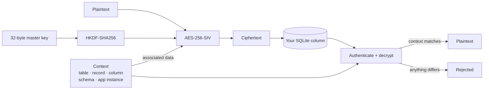

<div align="center">

# FloorVault

**Field-level encryption for SQLite that knows where each value belongs.**

Encrypt sensitive columns in ordinary Python `sqlite3` databases. No SQLCipher, no custom SQLite
build, no C extension. Each ciphertext is cryptographically bound to its table, record and column,
so a value moved anywhere else fails to decrypt.

<a href="https://github.com/Guerilla-ops/floorvault/actions/workflows/ci.yml"></a>
<a href="https://www.python.org/"></a>
<a href="LICENSE"></a>


[Quickstart](#quickstart) · [Guides](#guides) · [Security model](SECURITY.md) · [Format spec](docs/SPEC.md)

</div>

> [!WARNING]
> **Beta, and not yet on PyPI.** `pip install floorvault` does not work yet; install from this
> repository. Read the [security model](SECURITY.md) before protecting production secrets.

---

## Why FloorVault

Most SQLite encryption is all-or-nothing: encrypt the whole file with a patched build, or hand-roll
per-field crypto and hope nobody swaps two ciphertexts. FloorVault sits in between. It encrypts the
columns you choose, in the database you already have, and makes the location of every value part of
what gets authenticated.

| | |
| --- | --- |
| 🔐 **Misuse-resistant AEAD** | AES-256-SIV ([RFC 5297](https://www.rfc-editor.org/rfc/rfc5297)) with HKDF-SHA256 key derivation. Nonce reuse does not break confidentiality the way it does for GCM. |
| 📍 **Context binding** | Table, record ID, column, schema version and application instance are authenticated as associated data. Copy a ciphertext to another row and it is rejected. |
| 🗄️ **Your SQLite, unchanged** | Works on stock `sqlite3`. FloorVault never owns your schema or your transactions. |
| 🔑 **Fail-closed key custody** | macOS Keychain, Windows DPAPI and Linux Secret Service. If no safe store is available it raises an error instead of quietly writing a key to disk. |
| 🔄 **Lifecycle built in** | Plaintext column migration, residue-scrubbing column drop, resumable key rotation and authenticated recovery bundles. |
| 🔎 **Opt-in search** | Truncated, keyed beacons for exact-match lookup, with the leakage stated up front. |
| 📄 **Frozen wire format** | A normative [on-disk spec](docs/SPEC.md) with test vectors and an independent decoder, so a second implementation can read your data. |

## How it works



The context is never stored in the ciphertext. It is supplied again on every read, which means a
database thief who rearranges rows, swaps columns or replays values between tables gets
authentication failures rather than wrong-but-plausible data.

## Install

```bash
pip install "floorvault @ git+https://github.com/Guerilla-ops/floorvault.git"
```

or with [uv](https://docs.astral.sh/uv/):

```bash
uv add "floorvault @ git+https://github.com/Guerilla-ops/floorvault.git"
```

Add the extra for your platform's OS key store:

| Platform | Key store | Install |
| --- | --- | --- |
| macOS | Keychain | `uv add "floorvault[macos] @ git+https://github.com/Guerilla-ops/floorvault.git"` |
| Linux | Secret Service | `uv add "floorvault[linux] @ git+https://github.com/Guerilla-ops/floorvault.git"` |
| Windows | DPAPI | built in, no extra needed |

Without the extra, or on a headless Linux container, key resolution **fails closed** with a
`KeyProviderError` that lists your options. See [Key custody](#key-custody).

## Quickstart

```python
from floorvault import AdaptiveKeyProvider, FloorVault

master_key = AdaptiveKeyProvider(service_name="my-app").resolve_key()
crypto = FloorVault(master_key, app_instance_id="my-app")

ciphertext = crypto.encrypt("secret value", table="credentials", record_id="user-123", column="api_key")

crypto.decrypt(ciphertext, table="credentials", record_id="user-123", column="api_key")
# -> "secret value"

crypto.decrypt(ciphertext, table="credentials", record_id="user-456", column="api_key")
# -> raises DecryptionVerificationError: wrong record
```

Never hard-code a production master key. Resolve it from an OS key store or your own secret manager.

---

## Guides

- [Encrypt columns in an existing table](#encrypt-columns-in-an-existing-table)
- [Migrate a plaintext column](#migrate-a-plaintext-column)
- [Search encrypted values (opt-in)](#search-encrypted-values-opt-in)
- [Key custody](#key-custody)
- [Rotate keys](#rotate-keys)
- [Recovery bundles](#recovery-bundles)
- [Inspect a value from the CLI](#inspect-a-value-from-the-cli)

### Encrypt columns in an existing table

Add a column for the ciphertext, then read and write through the adapter:

```python
import sqlite3

from floorvault import AdaptiveKeyProvider, EncryptedSQLiteTable, FloorVault

connection = sqlite3.connect("app.db")
crypto = FloorVault(AdaptiveKeyProvider(service_name="my-app").resolve_key(), app_instance_id="my-app")

users = EncryptedSQLiteTable(connection, crypto, "users", id_column="id")

users.store("user-123", "api_token_cipher", "secret-token")
connection.commit()

token = users.load("user-123", "api_token_cipher")
```

Identifiers are allow-listed and quoted before any SQL is built. Record IDs and values are always
bound parameters or cryptographic inputs. Storing to a missing record raises; the adapter never
inserts a row on your behalf. `store_fields` / `load_fields` handle several columns at once, and
`load_bytes` returns raw bytes.

### Migrate a plaintext column

Encrypt an existing column into a new one, verify it, then drop the original:

```python
from floorvault import drop_plaintext_column, migrate_plaintext_column, verify_encrypted_column

migrate_plaintext_column(
    connection, crypto,
    table="users", id_column="id",
    source_column="private_value", destination_column="private_value_cipher",
)
connection.commit()

# Decrypts every row and compares it with the source. Raises on any mismatch.
verified = verify_encrypted_column(
    connection, crypto,
    table="users", id_column="id",
    source_column="private_value", destination_column="private_value_cipher",
)

# Only after verification and a backup you trust:
drop_plaintext_column(connection, table="users", column="private_value", vacuum=True)
```

Migration refuses a destination that already holds data, binds each value to its real record ID and
rolls back on failure.

`drop_plaintext_column` does more than `ALTER TABLE ... DROP COLUMN`, which leaves the old plaintext
readable in freed pages and the WAL. It turns on `secure_delete`, checkpoints and truncates the WAL
and, with `vacuum=True`, rewrites the file. It still cannot erase filesystem-level residue such as
old disk blocks or a deleted journal; only destroying the file guarantees that. The returned flags
tell you exactly what was scrubbed.

### Search encrypted values (opt-in)

Exact-match lookup needs something indexable beside the ciphertext. FloorVault's beacons are keyed,
truncated hashes: a bucket narrows the candidates, and decryption confirms the match.

```python
from floorvault.beacons import BeaconIndexer, derive_beacon_key, suggest_beacon_bits

# Size the bucket width to the table. Anonymity is roughly one bucket's occupancy.
indexer = BeaconIndexer(derive_beacon_key(master_key), bits=suggest_beacon_bits(200_000))

# Write: store the ciphertext and its beacon (put an index on email_beacon).
connection.execute(
    "INSERT INTO users (id, email_cipher, email_beacon) VALUES (?, ?, ?)",
    (record_id,
     crypto.encrypt(email, table="users", record_id=record_id, column="email_cipher"),
     indexer.beacon(email, scope="users.email")),
)

# Read: fetch the bucket, then confirm each candidate by decrypting.
bucket = indexer.beacon(email, scope="users.email")
for candidate_id, ciphertext in connection.execute(
    "SELECT id, email_cipher FROM users WHERE email_beacon = ?", (bucket,)
):
    if crypto.decrypt(ciphertext, table="users", record_id=candidate_id, column="email_cipher") == email:
        break
```

This workflow is executed by `tests/test_searchable_beacons.py`, not just documented.

> [!IMPORTANT]
> **Beacons leak by design.** Equal values share a beacon, so different beacons prove different
> values. Bucket sizes follow the plaintext distribution, so a skewed column gives a skewed
> histogram. On a small table a narrow beacon is close to exact equality. Don't beacon
> low-cardinality columns or columns you never look up by equality, and always confirm a hit by
> decrypting. Widths must be byte-aligned; `BeaconIndexer` rejects any width it can't actually
> store. Full statement in [SECURITY.md §5](SECURITY.md).

### Key custody

`AdaptiveKeyProvider` picks the strongest custody tier available and never silently drops below one
you asked for:

| Tier | Source | Notes |
| --- | --- | --- |
| 1 | Environment variable | `FLOOR_VAULT_KEY` or `VAULT_MASTER_KEY`, 64 hex chars. `APPSTATE_KEY` still works but is legacy and warns. |
| 2 | OS key store | macOS Keychain (`macos` extra), Windows DPAPI (stores outside the user profile are refused), Linux Secret Service (`linux` extra). |
| 3 | Local key file | `0600` file, **off by default**. Anyone who can copy the file has the key. |

If nothing usable applies, `resolve_key()` raises `KeyProviderError`. If a native backend exists
but is broken, it raises `CustodyDowngradeError` rather than falling back. Three ways forward:

```python
import os

from floorvault import AdaptiveKeyProvider, FloorVault

# 1. Your own secret source.
crypto = FloorVault(bytes.fromhex(os.environ["FLOOR_VAULT_KEY"]), app_instance_id="my-app")

# 2. Opt in to the local key file (Tier 3), created on first use.
crypto = FloorVault(
    AdaptiveKeyProvider(service_name="my-app", allow_disk_fallback=True).resolve_key(),
    app_instance_id="my-app",
)

# 3. Install your platform's extra and use the OS store.
crypto = FloorVault(AdaptiveKeyProvider(service_name="my-app").resolve_key(), app_instance_id="my-app")
```

Pass `strict=True` to forbid the local-file tier outright.

> [!NOTE]
> **Two process-wide side effects.** Creating a key handle sets `RLIMIT_CORE` to 0 and does not
> restore it, because a core dump of a process holding the master key would write that key to disk.
> Key memory is also page-locked on a best-effort basis where the platform allows.
>
> **Live CI coverage exists for Windows DPAPI only.** The Keychain and Secret Service tiers are
> implemented and unit-tested but not yet verified live. See [SECURITY.md](SECURITY.md).

### Rotate keys

`rotate_vault_store` re-seals a `VaultStore` under a new key. It journals progress so an interrupted
run resumes, and it verifies every item before returning.

```python
from pathlib import Path

from floorvault import AdaptiveKeyProvider, FloorVault, KeyRing, rotate_vault_store
from floorvault.vaultkit import VaultStore

VAULT_DIR = Path("~/.floor/vault").expanduser()  # VaultStore does not expand "~"

old_crypto = FloorVault(AdaptiveKeyProvider(service_name="my-app").resolve_key(), app_instance_id="my-app")
new_crypto = FloorVault(new_master_key, app_instance_id="my-app")

store = VaultStore(VAULT_DIR, crypto=old_crypto)
rotate_vault_store(store, source_ring=KeyRing({0: old_crypto}), new_vault=new_crypto, new_key_id=1)

# REQUIRED: the old store can no longer read anything. Rebuild it on the new key.
store = VaultStore(VAULT_DIR, crypto=new_crypto)
```

> [!CAUTION]
> **Rotation is durable, so get the order right.**
> 1. **Make the new key resolvable first.** If nothing can resolve the new key after a rotation,
>    you have a permanent outage.
> 2. **Rebuild the store, don't reuse it.** A store built on the old master raises
>    `DecryptionVerificationError` from `resolve_secret`, `get_meta` and `list_items`.
>    `has_items()` doesn't decrypt, so it won't warn you. A restart doesn't help either: if your
>    provider still returns the old key, the store stays unreadable.
>
> Changing only the key ID under the same master stays readable. To read across generations, pass a
> `KeyRing` to the ring-taking methods such as `read_sealed_item`.

### Recovery bundles

Wrap the master key under a separately held recovery key:

```python
from floorvault import recover_master_key, wrap_master_key

bundle = wrap_master_key(master_key, recovery_key)
recovered = recover_master_key(bundle, recovery_key)
```

The bundle is authenticated. `wrap_master_key` refuses a recovery key equal to the master key,
because that wouldn't be independent custody. Keep the recovery key away from the vault and its
backups.

### Inspect a value from the CLI

```bash
floorvault inspect app.db users user-123 private_value_cipher
```

> [!WARNING]
> `floorvault inspect` **decrypts** the field and prints plaintext to your terminal. Treat its output,
> and your shell history and scrollback, as secret.

---

## Threat model at a glance

| ✅ FloorVault protects against | ❌ FloorVault does not provide |
| --- | --- |
| Theft of the database file or individual ciphertexts | Isolation from malware running as the same user |
| Moving or swapping ciphertext between tables, rows or columns | Protection once the endpoint is compromised |
| Common cryptographic misuse, including nonce reuse | Hardware-backed trust on its own |
| Some key-memory exposure, where platform hardening succeeds | Whole-database freshness or rollback protection |
| | Erasing plaintext copies made by Python, OpenSSL or other dependencies |

To defend against replaying an old database, bind encryption to a caller-controlled revision that an
attacker can't roll back along with the data. The full model, including attacker capabilities and
authorised-use (agent) scenarios, is in [SECURITY.md §5](SECURITY.md).

## Assurance

We prefer measured claims to marketing ones. Across CI and the local security gate
(`scripts/security-check.sh`):

- **Cross-platform CI**: Linux on Python 3.10–3.14, plus macOS and Windows on 3.10 and 3.13.
- **Test vectors**: RFC 5297, all 1,342 [Project Wycheproof](https://github.com/C2SP/wycheproof)
  AES-SIV-CMAC vectors, and a from-spec independent AES-SIV implementation cross-checked against
  PyCryptodome.
- **Wire-format conformance**: frozen [format vectors](tests/vectors/) read back by an independent
  decoder.
- **Fuzzing**: a seeded property harness, plus coverage-guided ClusterFuzzLite runs on the envelope
  parser, AAD encoding, key-store reader, identifier validation and beacons.
- **Static and supply-chain checks**: gitleaks, ruff, Bandit, Semgrep CE, pip-audit, mutation checks
  and OpenSSF Scorecard.

No third-party security audit or cryptographic review has been done yet. That gap, and others, are
listed in
[SECURITY.md §8](SECURITY.md).

## Performance

Five independent 10,000-iteration runs on macOS with a 1,019-byte payload, including context binding
and envelope handling but no database I/O:

| Operation | FloorVault | Fernet |
| --- | ---: | ---: |
| Encrypt | 0.00583 ms | 0.00700 ms |
| Decrypt | 0.00517 ms | 0.00629 ms |

These numbers describe one workload, not a general claim. Reproduce them with:

```bash
uv run python scripts/benchmark_compare.py --iterations 10000 --json /tmp/floorvault-fernet.json
```

Methodology and limits: [`docs/COMPARATIVE-BENCHMARK-2026-09-15.md`](docs/COMPARATIVE-BENCHMARK-2026-09-15.md).

## Development

```bash
uv sync --extra dev
uv run pytest
uv run ruff check src/ tests/ scripts/ fuzz/
uv run ruff format --check src/ tests/ scripts/ fuzz/
uv run bandit -q -r src/ scripts/ fuzz/
bash scripts/security-check.sh   # full gate; also needs gitleaks and semgrep on PATH
```

## Documentation

| Document | What's in it |
| --- | --- |
| [`SECURITY.md`](SECURITY.md) | Threat model, crypto design, assurance and vulnerability reporting |
| [`docs/SPEC.md`](docs/SPEC.md) | Normative on-disk format: envelope, AAD encoding, beacons, key stores, recovery bundles |
| [`docs/PENTEST-2026-10-04.md`](docs/PENTEST-2026-10-04.md) | Latest adversarial test and its remediations |
| [`docs/ARCHITECTURE-REVIEW-2026-10-02.md`](docs/ARCHITECTURE-REVIEW-2026-10-02.md) | Architecture review |
| [`docs/COMPARATIVE-BENCHMARK-2026-09-15.md`](docs/COMPARATIVE-BENCHMARK-2026-09-15.md) | Benchmark methodology |
| [`docs/PERFORMANCE-HARDENING-COST-REVIEW-2026-09-15.md`](docs/PERFORMANCE-HARDENING-COST-REVIEW-2026-09-15.md) | Cost of each hardening measure |
| [`docs/CROSS-PLATFORM-CI-FINDINGS-2026-09-15.md`](docs/CROSS-PLATFORM-CI-FINDINGS-2026-09-15.md) | Platform-specific findings |

## Reporting a vulnerability

Please don't open a public issue. Follow the private reporting process in
[SECURITY.md §2](SECURITY.md#2-reporting-a-vulnerability).

## License

Dual-licensed under [MIT](LICENSE-MIT) or [Apache 2.0](LICENSE-APACHE), at your option.
