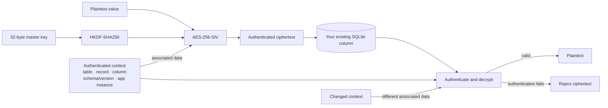

<div align="center">
  <h1>FloorVault</h1>
  <p><strong>Context-bound, misuse-resistant field encryption for SQLite.</strong><br>
  Protect sensitive values in ordinary Python <code>sqlite3</code> databases—without SQLCipher, a custom SQLite build, or a C extension.</p>
  <p><a href="#quickstart">Quickstart</a> · <a href="#existing-sqlite-tables">SQLite adapter</a> · <a href="SECURITY.md">Security model</a></p>
  <p>
    <a href="https://www.python.org/"></a>
    <a href="LICENSE"></a>
  </p>
</div>

> **Beta software:** Review the [security model](SECURITY.md) before using FloorVault for production secrets.

## How it works

FloorVault authenticates each encrypted value against the place it belongs. A different table, record, column, schema, or application instance causes authentication to fail.



## Why FloorVault?

| Capability | What it gives you |
| --- | --- |
| **Authenticated encryption** | AES-256-SIV (RFC 5297) with HKDF-SHA256 key derivation. |
| **Context binding** | Ciphertext is tied to its table, record, column, schema, and application instance. |
| **Ordinary SQLite** | Field-level encryption for existing Python `sqlite3` databases; no SQLCipher, custom build, or C extension. |
| **Key custody** | Native providers for macOS, Windows, and Linux; fail-closed behavior instead of a silent downgrade. |
| **Lifecycle tools** | Safe field migration, resumable key rotation, and authenticated master-key recovery bundles. |
| **Memory hardening** | Best-effort page locking and process core-dump limits, where supported. |
| **Optional search** | Searchable beacons are opt-in and make their leakage trade explicit; see [Searchable beacons](#searchable-beacons-opt-in). |

## Install

FloorVault is **not yet published to PyPI** — `pip install floorvault` does not
work yet. Install from the repository directly:

```bash
pip install "floorvault @ git+https://github.com/Guerilla-ops/floorvault.git"
```

With `uv`:

```bash
uv add "floorvault @ git+https://github.com/Guerilla-ops/floorvault.git"
```

macOS Keychain support is optional:

```bash
uv add "floorvault[macos] @ git+https://github.com/Guerilla-ops/floorvault.git"
```

Linux Secret Service support is optional too:

```bash
uv add "floorvault[linux] @ git+https://github.com/Guerilla-ops/floorvault.git"
```

A stock install does **not** give the key provider an OS store
on every host: macOS Keychain and Linux Secret Service need their platform extras,
Windows uses DPAPI built in, and the local-file tier is off unless you enable it.
If no usable provider applies (for example, macOS without its extra or a headless
Linux container), `resolve_key()` fails closed with a `KeyProviderError` that
names the remedies rather than writing an unprotected key. See
[Key custody](#key-custody).

## Quickstart

This example uses an available OS-backed key store. macOS Keychain support needs
the `macos` extra; Linux Secret Service support needs the `linux` extra; Windows
uses DPAPI. If no usable provider is available, key resolution fails closed. See
[Key custody](#key-custody) for the options.

```python
from floorvault import AdaptiveKeyProvider, FloorVault

master_key = AdaptiveKeyProvider(service_name="my-app").resolve_key()
crypto = FloorVault(master_key, app_instance_id="my-app-instance")

ciphertext = crypto.encrypt(
    "secret value",
    table="credentials",
    record_id="user-123",
    column="api_key",
)

plaintext = crypto.decrypt(
    ciphertext,
    table="credentials",
    record_id="user-123",
    column="api_key",
)

assert plaintext == "secret value"
```

The same ciphertext will not decrypt successfully when supplied with a different table, record ID, column, schema, or application instance.

Never hard-code a production master key in source code. Use an OS-backed provider or an external secret source.

## Existing SQLite tables

FloorVault does not own your schema or transactions. Add an encrypted column to an existing table, then use the adapter:

```python
import sqlite3

from floorvault import AdaptiveKeyProvider, EncryptedSQLiteTable, FloorVault

connection = sqlite3.connect("app.db")
master_key = AdaptiveKeyProvider(service_name="my-app").resolve_key()
crypto = FloorVault(master_key, app_instance_id="my-app")

fields = EncryptedSQLiteTable(
    connection,
    crypto,
    "users",
    id_column="id",
)

fields.store("user-123", "api_token_cipher", "secret-token")
connection.commit()

token = fields.load("user-123", "api_token_cipher")
```

Table and column identifiers are validated before SQL is constructed. Record IDs and values remain bound parameters or cryptographic inputs. A missing record is an error; the adapter never inserts one accidentally.

## SQLAlchemy ORM adapter

With the `sqlalchemy` extra installed, `SqlAlchemyEncryption` binds encrypted fields onto mapped classes. Plaintext-facing attributes are descriptors that encrypt at assignment — plaintext never occupies a mapped column — and writes that cannot bind per-record coordinates are refused.

```python
from sqlalchemy import Column, LargeBinary, String
from sqlalchemy.orm import DeclarativeBase
from floorvault import SqlAlchemyEncryption, EncryptedField

vault = SqlAlchemyEncryption(crypto, schema_id="my-app.v1")


class User(Base):
    __tablename__ = "users"
    id = Column(String, primary_key=True)
    tenant = Column(String, nullable=False)
    ssn_ct = Column(LargeBinary, nullable=True)


vault.protect(User, id_attr="id", tenant_attr="tenant", fields={"ssn": "ssn_ct"})
Session = vault.session_factory(bind=engine)

user = User(id="u1", tenant="acme")  # identity attrs first — binding needs them
user.ssn = "123-45-6789"  # encrypts here; only ciphertext is mapped
```

Fail-closed invariants (full contract: [SPEC.md §14.1](docs/SPEC.md)):

- `obj.ssn_ct = b"plaintext"` is refused at assignment — only envelope-shaped values may occupy a ciphertext column.
- `session.execute(insert(User).values(ssn_ct=...))`, executemany sets, `Query.update`, and the legacy bulk APIs (`bulk_insert_mappings`/`bulk_update_mappings`/`bulk_save_objects`) on ciphertext columns or protected classes raise `UnsupportedWriteError`.
- `tenant_attr` binds the tenant into the record coordinate, so a ciphertext cannot be replayed across tenants; `revision_attr` binds a per-record revision (same-coordinate replay detection, not whole-database rollback protection).

## Searchable beacons (opt-in)

Exact-match lookups over an encrypted column need an indexed value beside the ciphertext. Storing one leaks something, so this is opt-in and it is a trade you make deliberately.

The snippet continues the example above (`connection` and `master_key`); this workflow is executed by `tests/test_searchable_beacons.py` rather than only described.

```python
from floorvault import FloorVault
from floorvault.beacons import BeaconIndexer, derive_beacon_key, suggest_beacon_bits

crypto = FloorVault(master_key, app_instance_id="my-app")

# Size the width to the table, don't pick a constant: the anonymity a beacon
# gives is roughly one bucket's occupancy.
indexer = BeaconIndexer(derive_beacon_key(master_key), bits=suggest_beacon_bits(200_000))

# On write: store the ciphertext and the beacon in an indexed column.
connection.execute(
    "INSERT INTO users (id, email_cipher, email_beacon) VALUES (?, ?, ?)",
    (
        record_id,
        crypto.encrypt(email, table="users", record_id=record_id, column="email_cipher"),
        indexer.beacon(email, scope="users.email"),
    ),
)

# On read: the bucket narrows candidates; decryption confirms the match.
bucket = indexer.beacon(email, scope="users.email")
for candidate_id, ciphertext in connection.execute(
    "SELECT id, email_cipher FROM users WHERE email_beacon = ?", (bucket,)
):
    plaintext = crypto.decrypt(
        ciphertext, table="users", record_id=candidate_id, column="email_cipher"
    )
    if plaintext == email:
        break  # confirmed
```

What this costs: equal values produce equal beacons, so unequal beacons prove unequal values; and bucket occupancy still tracks the distribution of the plaintext, so a heavily skewed column shows a correspondingly skewed beacon histogram. Truncation makes the index non-injective — it does not make the data uniform. A small table with a narrow beacon is close to exact equality, so size the width to the row count. Do not beacon a low-cardinality column, and do not beacon a column you never look up by equality. Full statement: [SECURITY.md §5](SECURITY.md).

Widths are byte-aligned, so 4 and 8 bits are the same index; `BeaconIndexer` rejects a width it cannot store rather than rounding it and describing it as something else. A beacon hit is not proof of equality — always confirm by decrypting.

## Migrate existing plaintext columns

Migrate into a new encrypted column without deleting the original source:

```python
from floorvault import migrate_plaintext_column, verify_encrypted_column

migrate_plaintext_column(
    connection,
    crypto,
    table_name="users",
    id_column="id",
    source_column="private_value",
    destination_column="private_value_cipher",
)
connection.commit()

assert verify_encrypted_column(
    connection,
    crypto,
    table_name="users",
    id_column="id",
    source_column="private_value",
    destination_column="private_value_cipher",
)
```

The migration validates identifiers, refuses a populated destination, binds each value to its real record ID, and rolls back on failure. Remove the plaintext column only after independent verification and an appropriate backup policy.

## Key custody

`AdaptiveKeyProvider` selects an available custody tier rather than silently weakening an explicitly requested one:

- macOS Keychain (needs the `macos` extra)
- Windows DPAPI (built in; a store outside the user profile is refused)
- Linux Secret Service
- protected local fallback where permitted

Resolving a key without an OS store — the case the quickstart hits on macOS without
the extra, or in a headless container — fails closed with a `KeyProviderError`. The
three ways to resolve it:

```python
import os

from floorvault import AdaptiveKeyProvider, FloorVault

# 1. Explicit key, 64 hex characters, from your own secret source.
crypto = FloorVault(
    bytes.fromhex(os.environ["APPSTATE_KEY"]),
    app_instance_id="my-app",
)

# 2. A 0600 local key file, created on first use and reused afterwards. This is
#    Tier 3: anyone who can copy the file can recover the key.
crypto = FloorVault(
    AdaptiveKeyProvider(service_name="my-app", allow_disk_fallback=True).resolve_key(),
    app_instance_id="my-app",
)

# 3. Install the OS-native tier for the platform (floorvault[macos] on macOS).
crypto = FloorVault(
    AdaptiveKeyProvider(service_name="my-app").resolve_key(),
    app_instance_id="my-app",
)
```

`APPSTATE_KEY`, `FLOOR_VAULT_KEY` and `VAULT_MASTER_KEY` are the recognised
environment variables. Pass `strict=True` to forbid the local-file tier outright.

The local fallback is protected by the filesystem and OS-account boundary; it is not equivalent to hardware-backed or OS-managed secret custody. If a native backend is present but unusable, FloorVault can fail closed with `CustodyDowngradeError`.

Constructing a key handle also disables core dumps for the whole process (`RLIMIT_CORE` is set to 0 and not restored), since a core dump of a process holding a master key would write that key to disk. An application that needs its own crash dumps should know this happens on first key construction.

Live CI coverage exists for Windows DPAPI only. The macOS Keychain and Linux Secret Service tiers are implemented and unit-tested but not live-verified — see the per-tier verification status in [`SECURITY.md`](SECURITY.md).

### Vault Transit custody

`VaultTransitProvider` keeps the master key wrapped by a HashiCorp Vault Transit key instead of a local file; the wrapped blob lives in a governed on-disk generation store ([SPEC.md §10.6–10.7](docs/SPEC.md)):

```python
from floorvault.providers.vault_transit import VaultTransitProvider

provider = VaultTransitProvider(
    vault_addr="https://vault.internal:8200",
    token=os.environ["VAULT_TOKEN"],  # Transit datakey/decrypt/rewrap perms
    key_name="floorvault-master",
    store_dir="/var/lib/myapp/floorvault",  # 0700; holds store.id + generations
    app_instance_id="my-app",
)
crypto = FloorVault(provider.resolve_key(), app_instance_id="my-app")

# Rewrap under a new Transit KEK version (CAS-publishes a new generation):
provider.rewrap()
```

Every Vault failure raises `CustodyDowngradeError`; a configured provider never silently falls back to file custody. HTTPS only, verified TLS, bounded timeouts/retries, redirects refused unless a standby host is explicitly trusted. The resolved key is cached briefly (300 s default) — that bounds Transit latency; it is not revocation protection.

## Rotation and recovery

Rotate a store under a new key with resumable progress and post-rotation verification:

```python
from floorvault import AdaptiveKeyProvider, FloorVault, KeyRing, rotate_vault_store

# VaultStore is the structured item store this rotation operates on; it is not
# re-exported at the top level.
from floorvault.vaultkit import VaultStore
from pathlib import Path

# VaultStore does NOT expand "~" -- a literal tilde would become a directory
# named "~" relative to the working directory. Expand it explicitly.
VAULT_DIR = Path("~/.floor/vault").expanduser()

old_crypto = FloorVault(
    AdaptiveKeyProvider(service_name="my-app").resolve_key(),
    app_instance_id="my-app",
)
store = VaultStore(VAULT_DIR, crypto=old_crypto)

# A new_master_key from your key provider, wrapped in its own engine.
new_crypto = FloorVault(new_master_key, app_instance_id="my-app")

rotate_vault_store(
    store,
    source_ring=KeyRing({0: old_crypto}),
    new_vault=new_crypto,
    new_key_id=1,
)

# REQUIRED: the `store` above was built on old_crypto and CANNOT read the
# re-sealed records -- rotation sealed every envelope under the NEW master key.
# Rebuild the store on the new key and repoint every holder of the old one.
store = VaultStore(VAULT_DIR, crypto=new_crypto)
```

**When rotating to different key material, rebuild the original `store`.** It
holds the old master key, so its convenience reads cannot authenticate records
sealed under the new master. `resolve_secret`, `get_meta`, and `list_items` then
raise `DecryptionVerificationError`; `has_items()` does not decrypt and cannot
surface this mismatch. The master change, not the authenticated key-id change
alone, causes unreadability. An id-only rotation under the same master and
application scope remains readable through the original convenience methods.

Rotation is durable and verified before it returns, so this is not a transient state: after a
rotation to new key material, if your process exits before rebuilding the store — and your key
provider still resolves the old key — the store stays unreadable across restarts until the
provider is updated.

Two rules that follow:

- **Rebuild the store, don't mutate it.** There is no `KeyRing` parameter on `VaultStore`, so
  switching generations means constructing a new store on the new key and updating every reference.
- **Update the key provider first**, or make the new key resolvable before you rotate. A rotation
  whose new key nothing can resolve is a durable outage.

To read a store that spans generations, use `KeyRing` directly with the ring-taking methods
(`read_sealed_item`) rather than the single-key convenience accessors above.

Create an authenticated recovery bundle using a separately protected recovery key:

```python
from floorvault import recover_master_key, wrap_master_key

bundle = wrap_master_key(master_key, recovery_key)
recovered = recover_master_key(bundle, recovery_key)
```

The recovery bundle is not a substitute for protecting the recovery key. Keep that key separate from the vault and its backups.

## Security boundaries

FloorVault protects against:

- database or ciphertext theft;
- accidental cryptographic misuse;
- moving ciphertext to another authenticated context;
- some forms of key-memory exposure, where platform hardening succeeds.

FloorVault does not provide:

- process isolation against same-user malware;
- endpoint compromise protection;
- hardware-backed trust by itself;
- whole-database freshness or rollback protection;
- protection from plaintext copies created by Python, OpenSSL, or other dependencies.

For replay protection, bind encryption to a caller-controlled revision that an attacker cannot roll back with the database.

## Performance

A measured macOS benchmark using five independent 10,000-iteration runs and a 1,019-byte payload reported:

| Operation | FloorVault | Fernet |
|---|---:|---:|
| Encrypt | 0.00583 ms | 0.00700 ms |
| Decrypt | 0.00517 ms | 0.00629 ms |

These are workload-specific measurements, not universal performance claims. The benchmark includes contextual AAD and envelope handling but no database I/O.

Reproduce it with:

```bash
uv run python scripts/benchmark_compare.py --iterations 10000 --json /tmp/floorvault-fernet.json
```

See [`docs/COMPARATIVE-BENCHMARK-2026-09-15.md`](docs/COMPARATIVE-BENCHMARK-2026-09-15.md) for methodology and limits.

## CLI

`floorvault inspect` **decrypts** a field and prints the plaintext. Treat its
output as secret:

```bash
floorvault inspect local_vault.db users user-123 private_value_cipher
```

## Development

```bash
uv sync --extra dev
uv run pytest
uv run ruff check src/ tests/ scripts/ fuzz/
uv run ruff format --check src/ tests/ scripts/ fuzz/
uv run bandit -q -r src/ scripts/ fuzz/
bash scripts/security-check.sh   # full gate; also needs gitleaks and semgrep on PATH
```

The project tests on Linux, macOS, and Windows across supported Python versions. Security-gate details and cross-platform findings are documented in [`SECURITY.md`](SECURITY.md) and [`docs/CROSS-PLATFORM-CI-FINDINGS-2026-09-15.md`](docs/CROSS-PLATFORM-CI-FINDINGS-2026-09-15.md).

## Documentation

- [`SECURITY.md`](SECURITY.md) — security model, limitations, and reporting guidance
- [`docs/COMPARATIVE-BENCHMARK-2026-09-15.md`](docs/COMPARATIVE-BENCHMARK-2026-09-15.md) — benchmark methodology
- [`docs/PERFORMANCE-HARDENING-COST-REVIEW-2026-09-15.md`](docs/PERFORMANCE-HARDENING-COST-REVIEW-2026-09-15.md) — hardening trade-offs
- [`docs/CROSS-PLATFORM-CI-FINDINGS-2026-09-15.md`](docs/CROSS-PLATFORM-CI-FINDINGS-2026-09-15.md) — platform-specific findings

## License

FloorVault is dual-licensed under:

- [MIT](LICENSE-MIT)
- [Apache License 2.0](LICENSE-APACHE)


